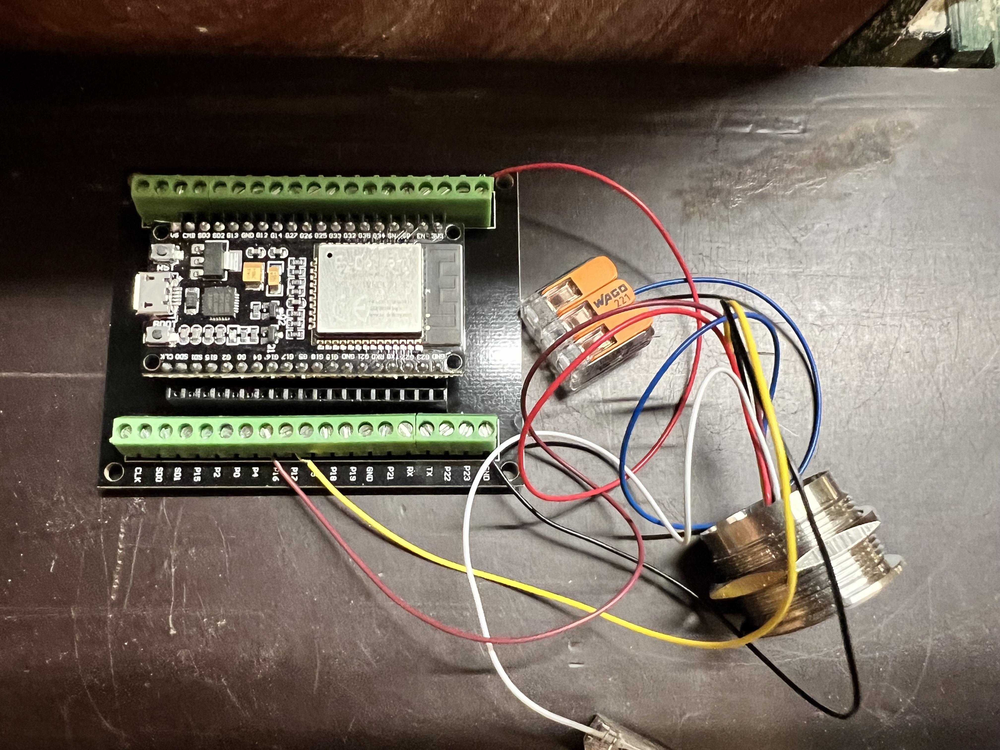

Simple sketch that allows you to trigger your smart door lock via fingerprint sensor. As the "door opening" part is only an API call, this can easily be altered to do other things as well. 

Worth mentioning features:
- Admin finger
- Add new fingers right from the sensor (long hold admin finger for 10 seconds)
- Reset fingers (long hold admin finger for 20 seconds)
- Trigger smart door locks (e.g. Nuki bridge) via API call
- OTAUpdater
- MQTT connection for e.g. monitoring of the device

For more details and pictures please checkout the blog post about [opening my front door with my fingerprint](https://noegel.io/posts/2022-12-07-fingerprint-doorlock/).

## Wiring
Wiring is quite easy:

| R503 Pin          | R503 Description | ESP 32 Pin |
|:------------------|-----------------:|-----------:|
| 1 (red)           | DC 3.3V          | 3.3V       |
| 2 (black)         | Ground           | Ground     |
| 3 (yellow)        | TXD, Output      | P17        |
| 4 (brown or green) | RXD, Input       | P16       |

## Setup
Rename `Setup.h.orig` to `Setup.h` and configure as needed/described in that file.

### First boot
During the first run, the configured `SENSOR_PASSWORD` will be set for the sensor. Hereafter the `Adafruit_Fingerprint` class needs to be called with that password as second parameter.
The sketch handle that situation, just ensure to have set `FIRST_BOOT` to `true` during the first boot and to `false` in subsequent boots.

### OPEN_DOOR_CALL_API
When using a Nuki door lock with the corresponding bridge, you can simple define a URL like this to open the door. 
`http://192.168.123.123:8080/lockAction?nukiId=123456789&deviceType=0&action=3&token=9876543`. Detail regarding this API and how to get the corresponding IDs can be found in the [Nuki documentation](https://developer.nuki.io/page/nuki-bridge-http-api-1-13/4).

Another approach of integrating this into your smart home is e.g. emitting a MQTT event and let that be handled in e.g. IObroker. 

## Sources & Inspirations 
Based on the Adafruit Fingrerprint examples:
- https://github.com/adafruit/Adafruit-Fingerprint-Sensor-Library/blob/master/examples/fingerprint/fingerprint.ino
- https://github.com/adafruit/Adafruit-Fingerprint-Sensor-Library/blob/master/examples/emptyDatabase/emptyDatabase.ino
- https://github.com/adafruit/Adafruit-Fingerprint-Sensor-Library/blob/master/examples/enroll/enroll.ino

Shoutout to youtube.com/ModItBetter who made good efforts to combine those examples into one sketch that can be controlled soley via the sensor.

